# Architecture — supervised two-agent language-learning tutor

Architectural description of the prototype: layers, module structure, every
interface, the data model, and the runtime behaviour of a tutoring turn.

**This document is the implementer source of truth**, together with
[../requirements.md](../requirements.md) (`REQ-*`) and
[../decisions/](../decisions/). Bare section numbers below refer to **this
file**. §12 traces each requirement to the element that carries it.

Scope is the technical and compliance layer only. Pedagogical effectiveness is
out of scope.

---

## 1. System context

REQ-COMP. Adult tutor submits a learner query; PII is redacted at the input
boundary; the Data Retrieval Agent reads the curated knowledge base and the
minimal history schema; the Content Generation Agent (one local LLM) produces a
draft; grammar, safety, and source-support checks run; the tutor dashboard is
the only path to the learner. The minor never operates the system. Every step
appends to the per-turn audit log.

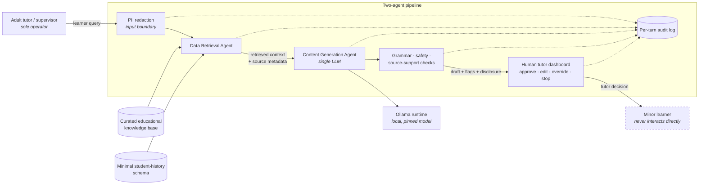

No external network dependency exists at runtime. Learner data never leaves the
host — a structural property, not a contractual one (DEC-0007).

## 2. Architectural style and the dependency rule

Hexagonal (ports and adapters) over four layers, with a strict inward dependency
rule.

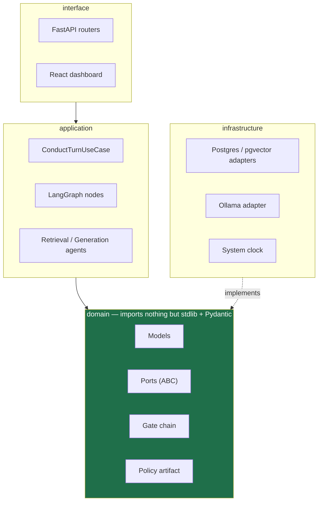

**The rule.** Arrows point inward only. `domain` imports no framework — no
FastAPI, no LangGraph, no SQLAlchemy, no HTTP client. `infrastructure` depends
on `domain` because it *implements* its ports; the reverse never happens.
Enforced by `import-linter` in CI, not by convention.

This is what makes the compliance claims testable: the domain runs with every
adapter substituted, so a scripted scenario replays without a database or a
model.

## 3. Module structure

This is the **target** layout, not an inventory of the current tree. Much of it
is still an empty package. The phase in which each part is created is given in
[IMPLEMENTATION-PLAN.md](IMPLEMENTATION-PLAN.md) — read build order there, not
here, so this section does not have to be edited on every ticket.

```text
tutor-core/src/tutor_core/           # pure domain + application, no I/O
  domain/
    models/        turn.py · audit.py · retrieval.py · learner.py · safety.py
                   verdict.py · timestamps.py — AwareDatetime (DEC-0010)
    ports/         fifteen ABCs, one per file (DEC-0001)
    gates/         registry.py + four gate classes
    policy/        policy_card.py — versioned, machine-readable
  application/
    services/      service.py · conduct_turn.py · record_human_action.py
    agents/        retrieval_agent.py · generation_agent.py
    turn/          graph.py · nodes.py

tutor-api/
  alembic.ini                  # revision naming, post-write ruff hooks
  alembic/versions/            # <UTC stamp>_<hash>_<slug>.py
  src/tutor_api/
    container.py               # provider registration — the only wiring site
    di/                        provider.py · container.py · dependency.py (DEC-0013)
    routers/                   sessions.py · audit.py · evidence.py
    adapters/
      persistence/             schema.py · database.py · unit_of_work.py
                               encryption_at_rest.py · aes_gcm_envelope.py (DEC-0012)
                               migration_environment.py · migration_session.py
                               audit_sink.py · knowledge_base.py · learner_history.py
      llm/                     ollama_model.py · local_embedding.py
      checks/                  grammar.py · safety.py · source_support.py · pii_redaction.py
      system_clock.py
    retention/                 scheduled GDPR retention enforcement

app/routes/                    # React Router v8 flat routes, DEC-0008
```

The port count is authoritative in [DEC-0001](../decisions/0001-interface-first-oop-di-capability-scoping.md),
which lists every one with its justification. If the two disagree, that record
wins and this section is stale.

### 3.1 Four roles (DEC-0011)

| Role | Meaning | Package |
| --- | --- | --- |
| Class | Pydantic domain model | `domain/models/` |
| ABC | Port; this *is* the interface | `domain/ports/` |
| Repo | Adapter behind an I/O port | `tutor-api/.../adapters/` |
| Service | Use case; typestate chain | `application/services/` |
| Router | HTTP boundary; `Depends()` only here | `tutor-api/.../routers/` |

Call direction is Router → Service → Port ← Adapter. A router does not import
an adapter. A service does not instantiate one. Domain imports no framework.

Authoring order, never reversed: ABC, then contract tests, then the concrete
class, then the router if the unit is reached over HTTP.

### 3.2 Service lifecycle (DEC-0011)

`ApplicationService` in `application/services/service.py` is a **typestate
chain**, not a domain port and not the gate chain. Each stage type exposes
exactly one public method: `prepare` → `Prepared.execute` →
`Executed.finalise`. Only `finalise` returns `TResult`. The router writes
`service.prepare(body).execute().finalise()`.

`ConductTurn`'s execute-handler delegates to the graph in
`application/turn/`. Gate order is graph placement (DEC-0005). Do not put
`prepare`, `execute`, and `finalise` on one class. Do not `dispose()` per
request — the container owns lifetimes (DEC-0013).

## 4. Ports

Fifteen `abc.ABC` interfaces in `domain/ports/`, each defined before its
implementation (DEC-0001).

### 4.1 Input boundary and retrieval

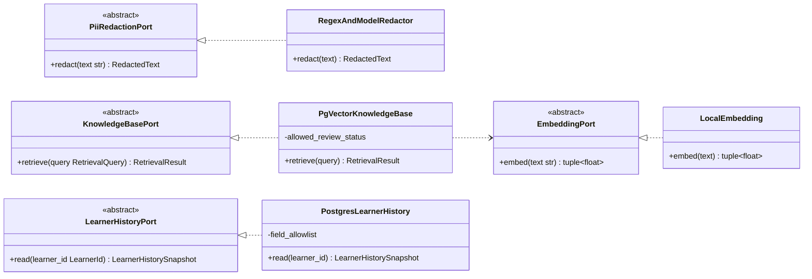

`PiiRedactionPort` runs at the input boundary, in real time, before the prompt
reaches any agent or the log (REQ-MINOR). `KnowledgeBasePort` exposes no
open-web method (REQ-KB). `LearnerHistoryPort` is read-only and allowlist-bound
(REQ-HISTORY).

### 4.2 Generation and output checks

REQ-COMP attaches three checks to the Content Generation Agent — grammar, safety
and source-support — plus an AI-generated disclosure and refusal for
out-of-scope prompts (REQ-ACCURACY, REQ-MINOR).

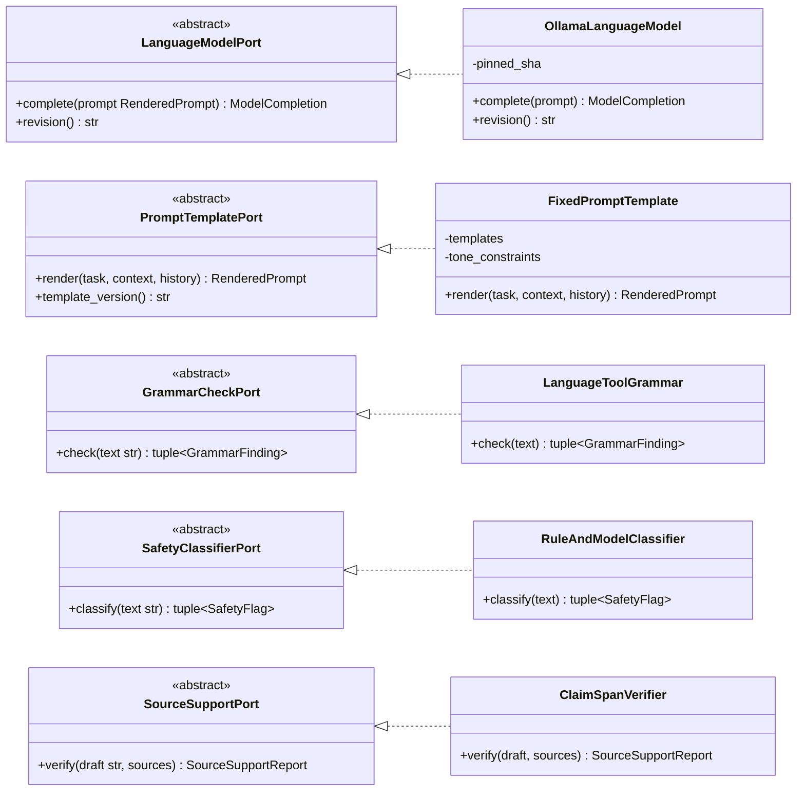

`SourceSupportPort` implements REQ-ACCURACY's hallucination control: it verifies
that key claims in a generated explanation are supported by retrieved sources
and **flags unsupported spans for human review** rather than silently removing
them.

`LanguageModelPort` takes a prompt and returns text. It has no retrieval method
and no HTTP client, so a prompt-injected instruction to fetch external content
has no reachable capability (REQ-ACCURACY; OWASP Top 10 for LLM Applications,
tool-scoping). `revision()` supplies the pinned SHA written into every audit
record.

`FixedPromptTemplate` carries the tone constraints and target proficiency level;
`template_version()` is logged, because REQ-ACCURACY treats prompt formulation
as a testable accuracy control rather than a cosmetic concern.

### 4.3 Oversight, audit and policy

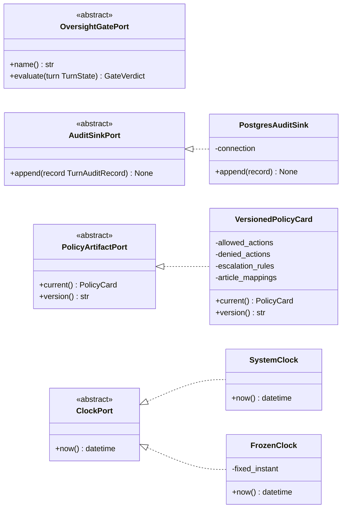

`AuditSinkPort` declares `append()` and nothing else — no update, no delete
(Art. 12, REQ-AUDIT).

`PolicyArtifactPort` implements REQ-POLICY: a machine-readable, versioned
deployment-layer artifact encoding allowed and denied actions, escalation
requirements, evidentiary logging, and mappings to the AI Act. Its version is
written into every audit record, so the log records not only what was generated
but **against which rule version it was checked**.

## 5. Domain model

Pydantic v2 throughout; `dataclass` prohibited (DEC-0002). **Audit and evidence
records** (`TurnAuditRecord`, `HumanAction`, `GateVerdict`) are frozen. Working
turn state is not: `TurnState` is accumulated across the turn (DEC-0010).
Immutability is required of the record written to the log, not of the in-flight
object.

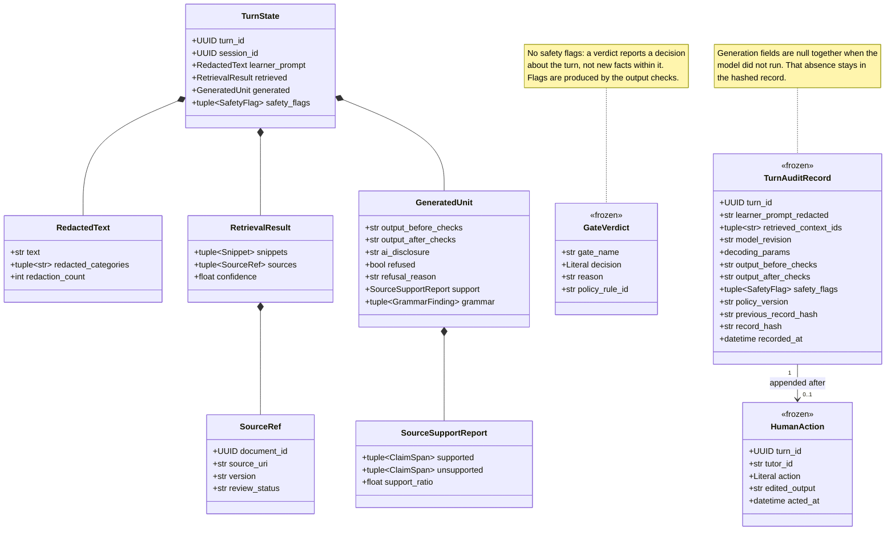

Frozen audit types use `ConfigDict(frozen=True, extra="forbid")`. Sequence
fields on those types are `tuple`, never `list` — a mutable member would defeat
the frozen guarantee. The in-memory type of `decoding_params` is left to
implementation; the log must record the parameters REQ-AUDIT names.

Two details that follow REQ-AUDIT:

- **The prompt is stored, not digested.** The log records the learner prompt.
  Data protection is achieved as REQ-MINOR prescribes — **real-time PII
  redaction at the input boundary** — so what is logged is the redacted prompt,
  with the categories redacted recorded alongside it.
- **Output before *and* after checks.** Both are stored when the model ran,
  and both are null when it did not. `human_action.edited_output` captures a
  third state when the tutor edits, on its own append-only row.

## 6. Oversight gate chain

Ordered handlers across the graph (DEC-0005, REQ-GATES). Four gates, one class
each.

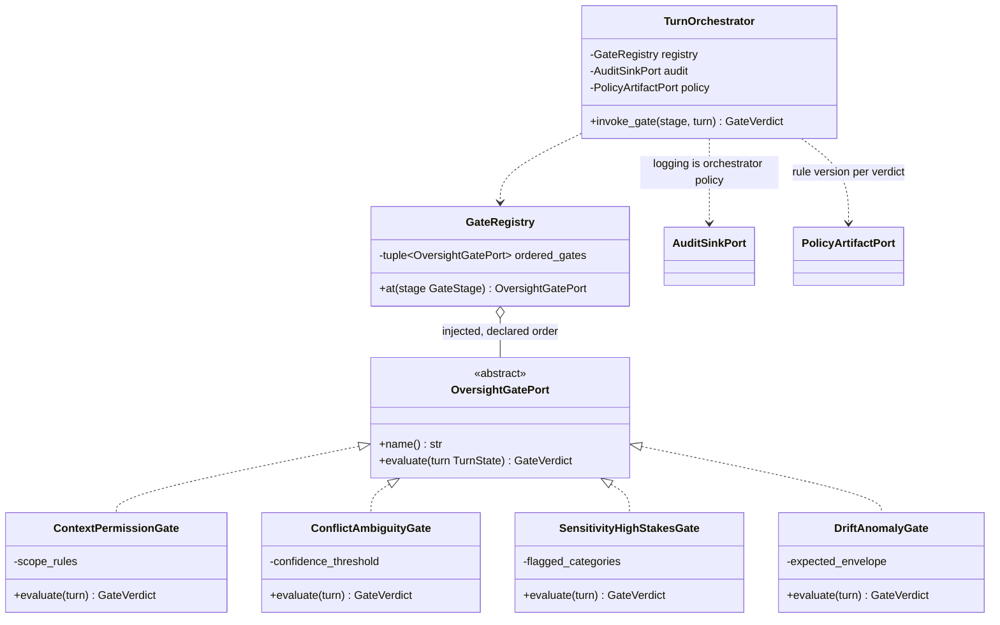

**There is no single-pass `run()` over a finished turn.** Each gate is invoked
at its own graph node, because REQ-GATES fixes different positions for different
gates. A single pass would require retrieval and generation to have already
executed before any gate is consulted, making the permission and conflict gates
detective rather than preventive — the failure DEC-0005 names explicitly.

Invariants:

- A gate **returns a verdict; it never mutates** the turn. A gate permitted to
  rewrite content would make the log ambiguous about what the model produced.
- **A non-pass verdict routes to human review, not to the next pipeline stage.**
  A permission `stop` means retrieval does not run.
- **Every gate that had sufficient input to evaluate is logged**, fired or not,
  with its `policy_rule_id`. A gate never reached because an earlier gate
  stopped the turn is recorded as `not_evaluated` with the reason. The log
  distinguishes *checked and passed*, *checked and fired*, and *not reached*.
- A failure inside a gate is a `stop`, not a `pass`. Fail closed.

## 7. Persistence

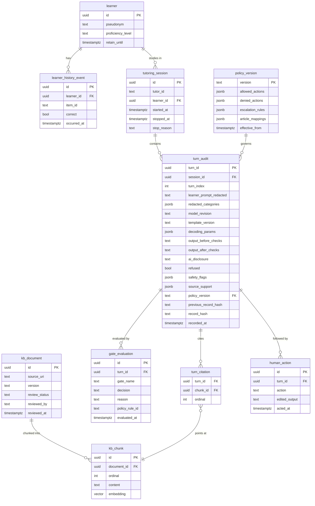

`kb_document.review_status` carries the REQ-KB ingestion checklist: nothing is
retrievable until reviewed. `learner.retain_until` carries the REQ-MINOR GDPR
retention policy, enforced by a scheduled job in `tutor-api/retention/`.

`turn_audit`, `gate_evaluation`, `turn_citation`, and `human_action` are
append-only, enforced twice — a `BEFORE UPDATE OR DELETE` trigger, and an
application role granted only `INSERT` and `SELECT` (DEC-0006). The turn row
is inserted once. Its generation columns are null together when the model did
not run, and that absence is part of the record `record_hash` covers. Gate
rows and citation rows reference the turn and commit with it. A cited chunk
is a foreign key in `turn_citation`, which is the stored form of
`retrieved_context_ids`. A tutor action is a later insert into `human_action`;
the turn row is not updated to hold it. `record_hash` chains each turn record
to its predecessor.

## 8. Runtime view

### 8.1 Control flow

REQ-GATES, plus two pipeline steps the gate table does not itself name: PII
redaction (REQ-MINOR) before the permission gate, and output checks
(REQ-ACCURACY) after generation. Grammar, safety and source-support are attached
to the Content Generation Agent in REQ-COMP; making them an explicit state here
is so the graph can interrupt on their flags.

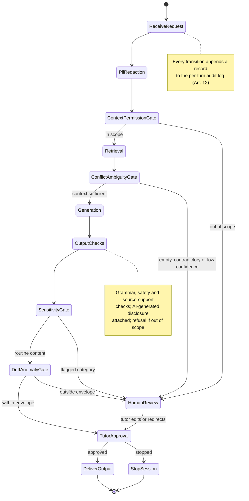

### 8.2 One turn, end to end

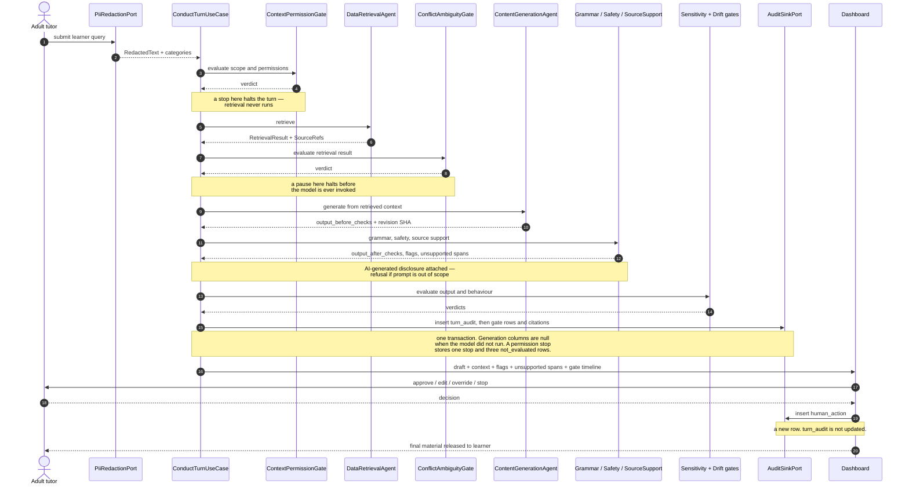

### 8.3 Invariants

1. **PII redaction precedes everything**, including the audit write. No
   unredacted learner text exists downstream of the boundary.
2. **The permission gate precedes retrieval.** A preventive control: verifying
   scope after a read proves nothing (DEC-0005, REQ-GATES).
3. **Retrieval always precedes generation**, as a graph edge. No path reaches
   the generation node without retrieval.
4. **A gate's non-pass verdict halts the pipeline and routes to human review.**
   Gates downstream of the halt are logged as `not_evaluated`, never run on
   absent input.
5. **Every output carries an AI-generated disclosure** (REQ-COMP, REQ-MINOR).
6. **Nothing reaches the learner without a tutor decision.** `pass` only means
   no gate objected; approval is still required.
7. **The turn row, its gate rows, and its citations commit together.** Generation
   columns are null when the model did not run, and that absence is part of the
   hashed record. A tutor action is a later insert into `human_action`. A turn
   is fully logged or it did not happen.
8. `stop` terminates the session and **preserves state**.

## 9. Compliance mapping

REQ-MAP — compliance distributed across the architecture rather than localised.

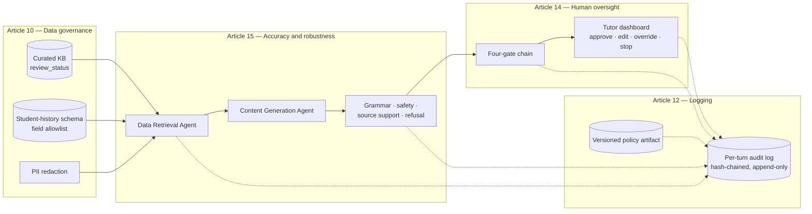

## 10. Cross-cutting concerns

**Time.** `ClockPort` injected everywhere; no `datetime.now()` in domain or
application code. Replay determinism depends on it.

**Composition.** `container.py` is the only site naming concrete classes.
`LifetimeValidation` checks the registration graph at startup, so a singleton
retaining request-scoped learner state fails the boot rather than leaking one
minor's history into another's session. The check is first-party (DEC-0013):
FastAPI's `Depends()` resolves per call and cannot see how long the object on
the other side lives.

**Retention.** `learner.retain_until` plus a scheduled purge, per REQ-MINOR's
GDPR retention requirement. Purges are themselves logged.

**Non-discrimination.** REQ-MINOR requires periodic review of retrieval and
generation outcomes across learner cohorts. Supported by a cohort-aggregation
query over `turn_audit`; that cohort review is a human activity, not an
automated control.

**Errors.** A failure inside a gate is a `stop`, not a `pass`. Fail closed.

## 11. Gate ordering

REQ-GATES and DEC-0005. Permission before retrieval, conflict before generation,
human stop before the learner. Ordering is enforced by graph structure, not by
the order of calls inside a method. An implementation that consults gates after
the work they govern has already run would falsify REQ-GATES — which is why
there is no single-pass chain over a finished turn (§6, DEC-0005).

The post-retrieval property — that what came back stayed in bounds — needs no
gate. It holds by construction, because `KnowledgeBasePort` exposes no open-web
method and `LearnerHistoryPort` is allowlist-bound (DEC-0001, REQ-KB,
REQ-HISTORY). The gate count stays at four.

## 12. Traceability — requirement to architecture

| Requirement | Architectural element |
| --- | --- |
| REQ-COMP Data Retrieval Agent | `DataRetrievalAgent`, `KnowledgeBasePort`, `LearnerHistoryPort`, `SourceRef` |
| REQ-COMP Content Generation Agent, single LLM | `ContentGenerationAgent`, `LanguageModelPort` |
| REQ-COMP grammar, safety and source-support | `GrammarCheckPort`, `SafetyClassifierPort`, `SourceSupportPort` |
| REQ-COMP / REQ-MINOR AI-generated disclosure | `GeneratedUnit.ai_disclosure`; invariant 8.3.5 |
| REQ-COMP / REQ-ACCURACY refusal | `GeneratedUnit.refused`, `refusal_reason` |
| REQ-DASH dashboard controls | `app/routes/_base.sessions.$sessionId` |
| REQ-KB ingestion checklist | `kb_document` |
| REQ-KB vetted sources only | `PgVectorKnowledgeBase.allowed_review_status` |
| REQ-HISTORY minimal schema, data minimisation | `LearnerHistoryPort` field allowlist |
| REQ-AUDIT prompt, context IDs, model, decoding params | `TurnAuditRecord` |
| REQ-AUDIT output before and after checks | `output_before_checks`, `output_after_checks` |
| REQ-AUDIT hash chain | `previous_record_hash`, `record_hash` |
| REQ-POLICY versioned policy artifact | `PolicyArtifactPort`, `policy_version` table |
| REQ-POLICY rule version per verdict | `gate_evaluation.policy_rule_id` |
| REQ-POLICY exportable trail | `routers/evidence.py` |
| REQ-GATES four gates | `domain/gates/`, four classes |
| REQ-GATES / DEC-0004 deterministic backbone | LangGraph graph + checkpointer |
| REQ-ACCURACY fixed prompt templates | `PromptTemplatePort`, `template_version()` |
| REQ-ACCURACY unsupported spans flagged | `SourceSupportReport.unsupported` |
| REQ-MINOR PII redaction at input boundary | `PiiRedactionPort`, invariant 8.3.1 |
| REQ-MINOR tone constraint | `FixedPromptTemplate.tone_constraints` |
| REQ-MINOR GDPR retention | `learner.retain_until`, `tutor-api/retention/` |
| REQ-MINOR / REQ-HISTORY cohort review | §10, cohort aggregation over `turn_audit` |

## 13. Deliberate limitations

- **Single learner, single tutor per session.** Concurrent multi-learner
  supervision is out of scope.
- **No authentication beyond a tutor identifier.** This prototype argues
  oversight mechanics, not identity management.
- **Drift gate is per-session.** REQ-GATES specifies monitoring behaviour
  against an expected envelope; true cross-cohort drift detection needs a
  longitudinal corpus this prototype does not collect. Report that bound with
  REQ-FIELD metrics.
- **Non-discrimination review is manual.** The architecture supplies the query;
  the periodic review is a human activity.
- **8B model.** Rubric scores will trail a frontier model; the object of study
  is the compliance architecture, not model quality (DEC-0007).
